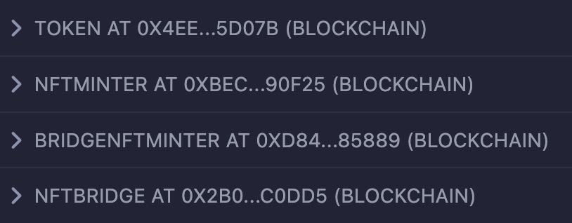

# NFT Bridge

A dapp for moving NFTs from one blockchain to another.

## Smart Contracts

- Token (token_alpha)
- NFTMinter (tom_and_jerry)
- BridgeNFTMinter (tom_and_jerry)
- NFTBridge (nft_bridge)

## Tools and Technologies Used

- nft:
  - IPFS, NFTs, Python
- contract:
  - Smart contracts (ERC20, IERC20, ERC721Enumerable, IERC721Enumerable, ReentrancyGuard, Ownable, IERC721Receiver)
  - Hardhat, Solidity, OpenZeppelin, Remix IDE, Blockchain, JavaScript, Mocha Testcases, Solidity code coverage
- dapp:
  - React.js, Web3.js, Nginx, Metamask wallet
- Docker and Containers
- Ethernal dashboard - EVM compatible private blockchain network explorer.
- GitHub actions

## How To Run?

- [Upload NFTs to IPFS](./nft/.vscode/tasks.json)
- [Deploy smart contracts to the blockchain](./contract/.vscode/tasks.json)
- [Run the dapp](./dapp/.vscode/tasks.json)

## Workflow

1. [Deploy on blockchain 1](./contract/scripts/deploy_blockchain_1.js)
2. [Deploy on blockchain 2](./contract/scripts/deploy_blockchain_2.js)
3. [Workflow for blockchain 1](./contract/scripts/workflow_blockchain_1.js)
4. [Workflow for blockchain 2](./contract/scripts/workflow_blockchain_2.js)
